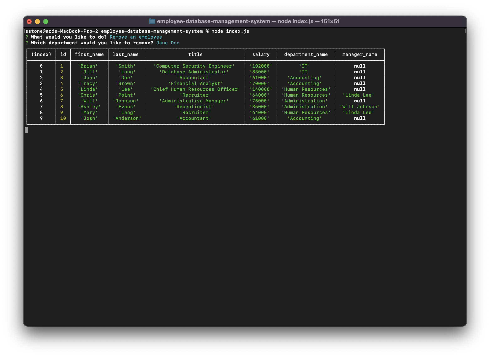

# Employee Database Management System

## Description

The Employee Database Management System app is an application that allows users to track and manipulate an employee database configured with `schema.sql` in the `db` folder.

This application uses `MySQL` to create, populate, and modify tables in a database for tracking the employees, roles, and departments of a company. The `schema.sql` file initalizes the database and tables and the `seeds.sql` file can be used to populate the database with some test data. Users can use their own methods or `seeds.sql` file to populate the database with their company's data.

The app also uses `inquirer` to prompt the user to choose a task to perform. Depending on the task, the user may be prompted further to enter the information required to create, update, or delete departments, roles, and employees.

With this application, the user is able to do the following tasks:

- view all departments
- view all roles
- view all employees
- add a department
- add a role
- add an employee
- update an eployee's role
- delete a department
- delete a role
- delete an employee

This project enhanced my skills and `mysql` knowledge, and allowed for more practice with `inquirer` prompts. As well, I learned how to use the `dotenv` package and `.env` file to store environment variables that shouldn't be shared.

## Table of Contents

- [Installation](#installation)
- [Usage](#usage)
- [License](#license)

## Installation

To install this application, first download everything in this GitHub repo: https://github.com/stms15/employee-database-management-system.

To initalize the database, I use `MySQLWorkbench`. You will need to have `mysql` downloaded and setup on your computer. Open `MySQLWorkbench` and start a connection using the creditentials you created.

Run the `schema.sql` file in the `db` folder in `MySQLWorkbench` to initalize the database and tables. You can then use the test data in the `seeds.sql` file in the `db` folder or your own methods/file to populate the database.

Before running the application, make sure you run `npm i` in the terminal to install all required packages. As well, you will have to create your own `.env` file with your own creditentials (`MYSQL_USERNAME` and `MYSQL_PASSWORD`) to access `mysql` and the database.

## Usage

**Before using:** Make sure you have a `.env` file with your `mysql` creditentials or you update the connection in the `index.js` file to connect to your own `mysql` account.

To use the application, run `node index.js` in the terminal. You will be presented with a list of options of tasks you can perform.

The "view" tasks will display the chosen table in the console. An example of the "roles" table is shown below.

The "add" tasks will prompt you for more information about the department/role/employee to be added. An example is shown below for the "add an employee" option.

To "update an employee's role", you will be prompted to choose an employee from the list of current employees, as well as a new role from the list of current roles. Then the employee's role and corresponding department will be changed.

Similar to the "add" tasks, the "remove" tasks require the user to choose the department/role/employee to delete.

A complete video showing how to use this application detailing each task can be found here: https://drive.google.com/file/d/1ihBP4fTypmIJWWEstiAQt5TIOIc9YX4z/view?usp=sharing.

## License

For more information about this license, please see the `LICENSE` file or visit https://spdx.org/licenses/MIT.html.

---

## Badges

